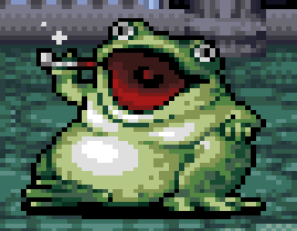

To find the flag, you must reverse image search the user Toad's avatar in the ScarletCTF Discord server. Since this is a writeup, the image in question will be placed below.
 
 

Obtaining the image to be reverse image searched can be done in numerous ways, but the simplest/lowest effort is to simply screenshot the profile

The most immediate option on google to start the trail is a reddit post, though it is not the only location on the internet with the image
This allows you to find more information of the images origins, coming from an old SNES game called Lufia 2. 
 
From there, searching for the games name and the word frog point you towards
multiple sites (and videos) containing the information on both the Frogs name (King Frog), as well as how much gold he has (350).