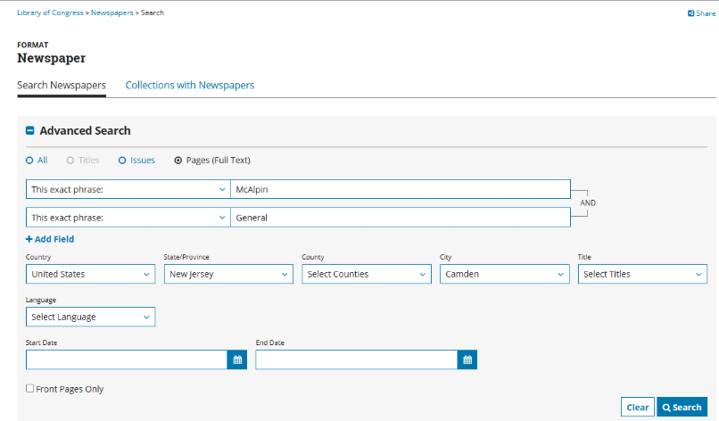

## Solution Steps
* If you picked up on the title of this challenge you can tell there are some descriptions of Scouts BSA magazine called Scout Life. From the search bar you can search up wayback and click the one that shows all past editions of the magazine from 1911-2012. https://scoutlife.org/wayback/ 
* Click any of the links, as it will not matter which decade you choose.
* Once you do there navigate to the search bar that is above a button called Search all issues. Click this.
* Click the search bar and type “Cheetah Hunt”, including the quotation marks.
* Navigate until you see a July 2012 issue.
* To find the ISSN, click About this magazine on the left-hand side of your screen.
* You will see the ISSN in about the middle of the page. *Note you must keep the dash in this instance for the flag to be correct.*
 

* To find the second part of the flag, you have to navigate to the Library of Congress website. This site can look up many 100-year-old newspaper articles. https://www.loc.gov/ 
* This historic organization is called the Boy Scouts. You will see a search bar at the top of the screen, type “Boy Scouts”(no need to include the quotation marks) and change the drop-down option to Newspapers.
* You will see the advanced search options, enter these search options
* 
* You will see an article from date March 25, 1916. Click it and you will see the name of the newspaper.
